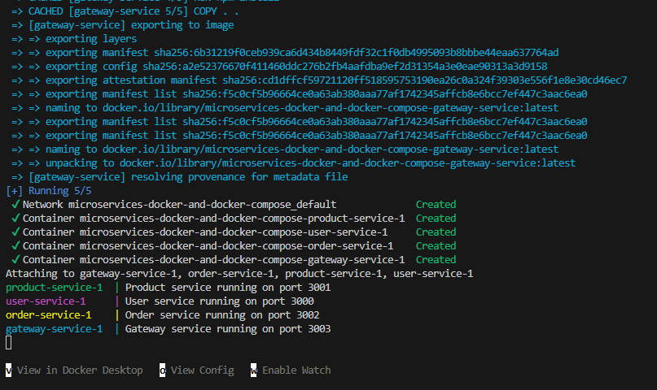
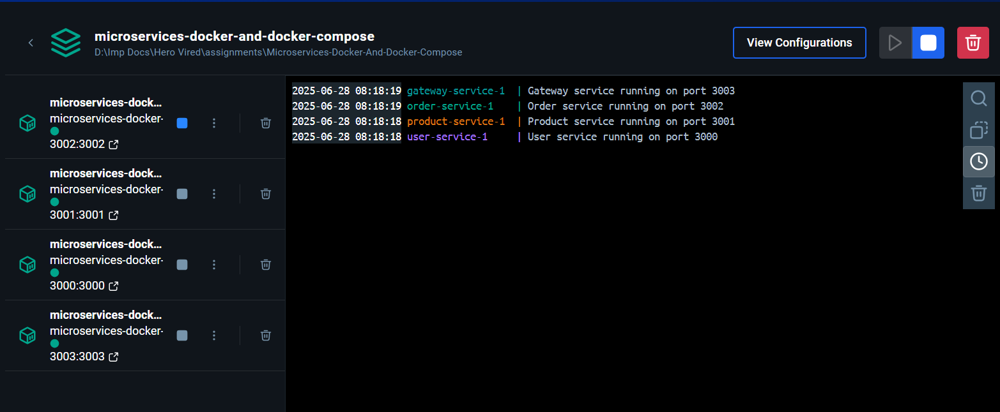
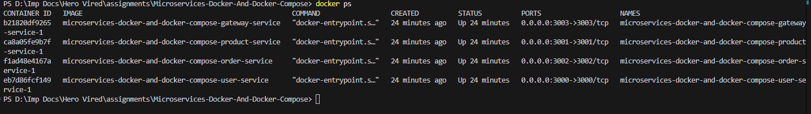
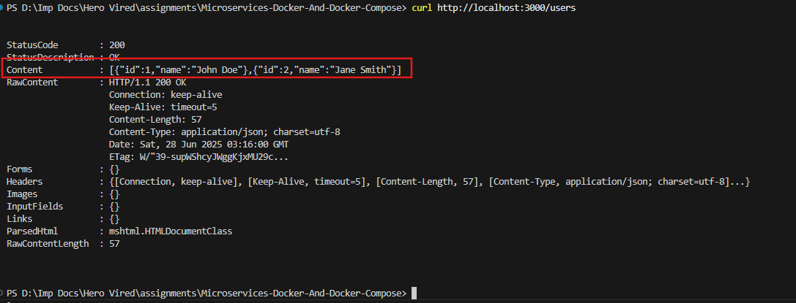
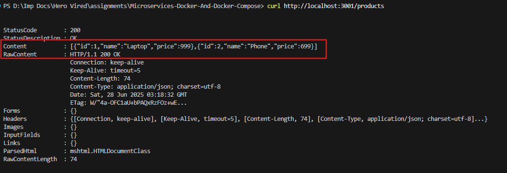
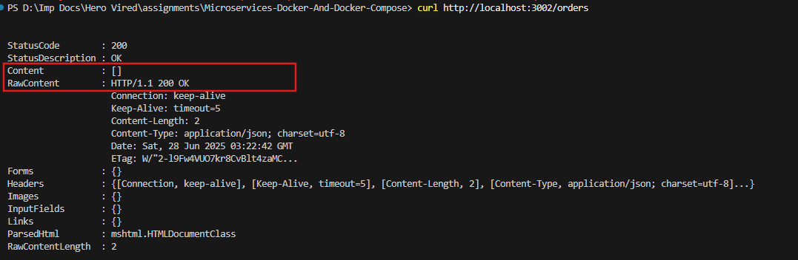
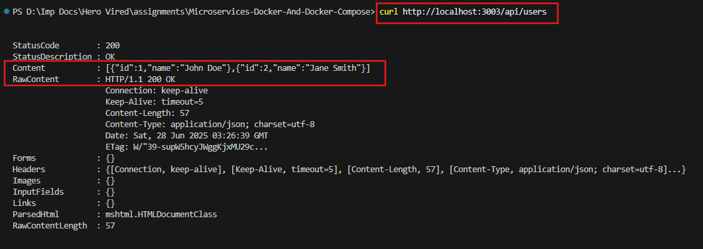
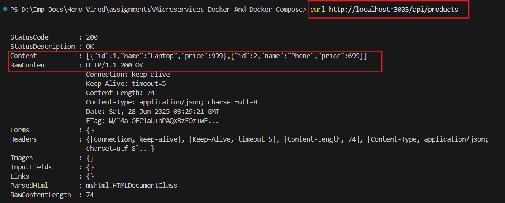
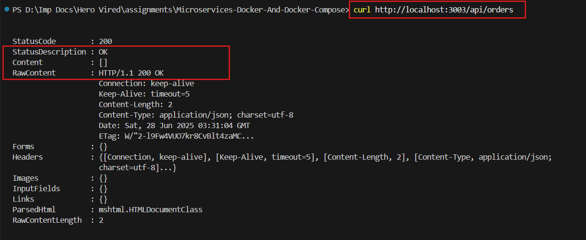

# 🐳 Microservices Containerization with Docker & Docker Compose

This project demonstrates the containerization of four Node.js microservices using Docker and Docker Compose.

---

## 📦 Microservices Included

| Service Name     | Description             | Port   | URL                     |
|------------------|--------------------------|--------|--------------------------|
| User Service     | Manages user operations  | 3000   | http://localhost:3000   |
| Product Service  | Manages product catalog  | 3001   | http://localhost:3001   |
| Order Service    | Handles order processing | 3002   | http://localhost:3002   |
| Gateway Service  | Entry point for all APIs | 3003   | http://localhost:3003   |

---

## 🛠️ Setup Instructions

### ✅ Prerequisites

- [Docker Desktop](https://www.docker.com/products/docker-desktop) installed
- Docker Compose (comes with Docker)


## Submission

submission/ <br />
├── user-service/ <br />
│ ├── Dockerfile <br />
│ ├── app.js <br />
│ └── package.json <br />
├── product-service/ <br />
│ ├── Dockerfile <br />
│ ├── app.js <br />
│ └── package.json <br />
├── order-service/ <br />
│ ├── Dockerfile <br />
│ ├── app.js <br />
│ └── package.json <br />
├── gateway-service/<br />
│ ├── Dockerfile<br />
│ ├── app.js<br />
│ └── package.json<br />
├── docker-compose.yml<br />
└── README.md

> Ensure each service has its own working `app.js` and `package.json`.

---

## 🚀 How to Run the Project

1. Open terminal and navigate to the `submission/` directory:
   ```bash
   cd path/to/submission/

2. Build and start all services:
    ```bash
    docker-compose up --build

3. You should see all services running in the terminal output.

4. Open your browser or Postman and access each service:
- User Service: `http://localhost:3000/`
- Product Service: `http://localhost:3001/`
- Order Service: `http://localhost:3002/`
- Gateway Service: `http://localhost:3003/`

## How to Test Each Service
    Use Postman, curl, or your browser (for GET endpoints):
    - User Service: `http://localhost:3000/users` (GET)
    - Product Service: `http://localhost:3001/products` (GET)
    - Order Service: `http://localhost:3002/orders` (GET)
    - Gateway Service: `http://localhost:3003/orders` (GET)

> Replace the URL with appropriate endpoints if defined in index.js (e.g., /api/users, /api/products, etc).

## Troubleshooting Tips
1. <b>Port already in use</b>: Change the port in docker-compose.yml or stop the service using the port.

2. Rebuild a specific service:
    ```bash
    docker-compose up --build user-service

3. View logs:
    ```bash
    docker-compose logs -f user-service

4. Stop all services:
    ```bash
    docker-compose down

5. Remove containers and rebuild everything:
    ```bash
    docker-compose down --volumes --remove-orphans
    docker-compose up --build

## Images






1. User Service API



2. Product Service API



3. Order Service API



4. Gateway Service

    4.  Gateway Service - User API
    

    4.  Gateway Service - Product API

    

    4. Gateway Service - Order API

    